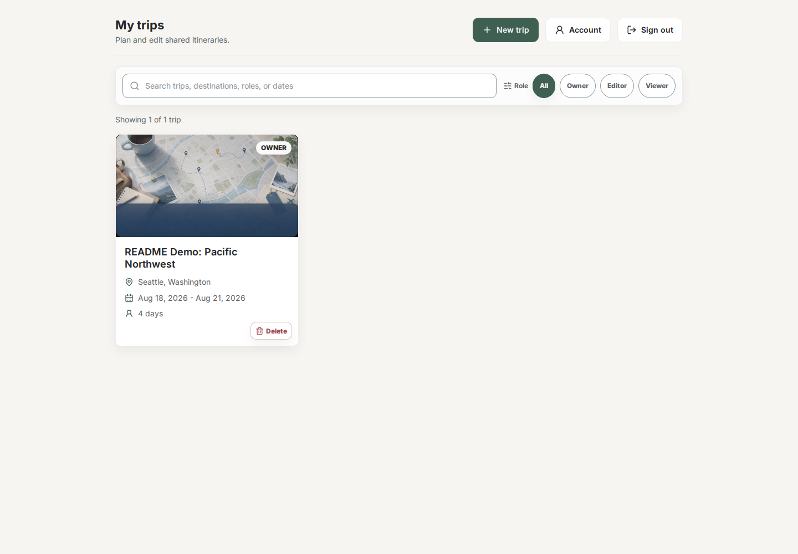
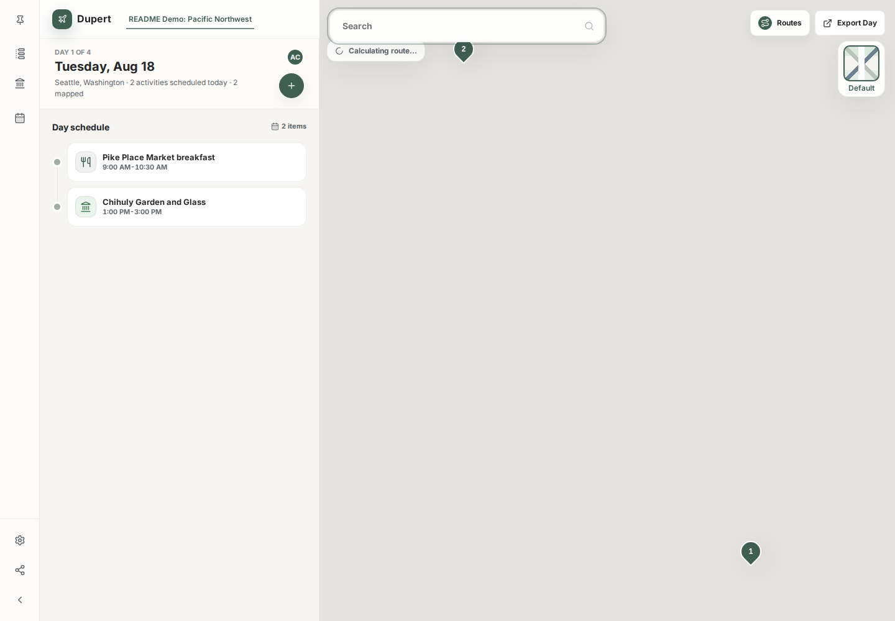

# Dupert

A collaborative trip-planning web app. Create a trip with a date range, then for each day pin places from a map (search by keyword or category — e.g. *"chinese food"*, *"museum"*), categorize each stop (meal, activity, snack, transport, lodging), assign optional times, and drag to reorder within a day or move across days. A second pane shows the day's stops as numbered markers on a map with a route polyline and per-leg travel times.

Trips can be shared two ways:

- **Invite a friend to sign up and join** — they become a full member of the trip.
- **Share a link with someone who won't log in** — they visit the link, pick a display name, and collaborate as an anonymous guest. The owner can revoke the link in one click.

Multiple viewers see each other's edits live (under a second) without manual refresh.

## Screenshots

These screenshots use the local demo seed data described in [Development Auth Testing](docs/development-testing.md).





## Tech stack

**Backend** — Java 21, Spring Boot 3.5, Gradle, Spring Security, Spring Data JPA, Flyway, JJWT, Bucket4j, PostgreSQL (hosted on [Neon](https://neon.tech)).

**Frontend** — Vite, React 19, TypeScript, React Router, TanStack Query, Zustand, Axios, `@microsoft/fetch-event-source` (SSE), `@vis.gl/react-google-maps`, `@dnd-kit`, `date-fns`. Plain CSS Modules.

**External services** — [Google Maps Platform](https://developers.google.com/maps) (browser map rendering plus backend-proxied Places, geocoding, photos, and routes); [Neon](https://neon.tech) (managed Postgres); [Brevo](https://www.brevo.com/) (transactional auth email in production).

**Realtime** — Server-Sent Events (`/api/trips/{id}/stream`); events carry pointers, not payloads, so subscribers always refetch through the authenticated API.

## Prerequisites

- **JDK 21** (Temurin recommended). Verify: `java -version` reports `21`.
- **Node 20+** and **npm**.
- A **Neon** project (free tier is fine). Grab the dev-branch connection string from the Neon dashboard.
- A **Google Maps Platform** browser API key for the Maps JavaScript API. Restrict this key by HTTP referrer to `http://localhost:3000/*` for local development and to your production origins later.
- A **Google Maps Platform** backend API key for Places API (New), Geocoding API, and Routes API requests. Restrict this key for backend use only.

No Docker, no local Postgres install, no global Gradle.

## Setup

```bash
git clone <this repo>
cd dupert
cp backend/.env.example backend/.env
cp frontend/.env.example frontend/.env
# Edit backend/.env and fill in real values for:
#   DATABASE_URL          (Neon connection string — wrap in single quotes if it
#                          contains '&', e.g. '...?sslmode=require&channel_binding=require')
#   JWT_SECRET            (generate: openssl rand -hex 32)
#   LOG_EMAIL_PEPPER      (generate: openssl rand -hex 16)
#   ALLOWED_ORIGINS       (exact frontend origin, e.g. http://localhost:3000)
#   APP_PUBLIC_FRONTEND_URL (same public frontend origin used in email links)
#   SPRING_PROFILES_ACTIVE=local for local development
#   GOOGLE_MAPS_API_KEY   (backend key for Places, Geocoding, Routes, and photos)
#   BREVO_API_KEY / APP_EMAIL_FROM_EMAIL / APP_EMAIL_FROM_NAME for production email
#   NVD_API_KEY           (optional, strongly recommended before Dependency-Check)
# Edit frontend/.env and fill in real values for:
#   VITE_GOOGLE_MAPS_API_KEY (browser key for Maps JavaScript rendering only)
#   VITE_BACKEND_API_URL     (optional backend base URL; leave empty for /api)
#   VITE_APP_ACCESS_PASSWORD (optional soft frontend wall password)
#   VITE_GOOGLE_MAPS_MAP_ID   (optional Google Maps vector map id)
```

Install frontend dependencies:

```bash
cd frontend
npm install
```

The backend uses the Gradle wrapper, so the first `./gradlew` invocation will fetch Gradle automatically — nothing to install ahead of time.

## Run (development)

Start both the backend and frontend from the repo root:

```bash
npm run dev
```

This sources `backend/.env` for the Spring Boot backend, defaults the backend to `SPRING_PROFILES_ACTIVE=local`, lets Vite load `frontend/.env`, starts the backend on http://localhost:8000, starts the frontend on http://localhost:3000, and stops both processes when you press `Ctrl+C`.

Open http://localhost:3000 in your browser. Vite proxies `/api/**` to the backend, so the SPA can call `/api/...` without CORS gymnastics during development.

Local auth testing seeds these users with password `password`:

| Email | Password | Name |
|---|---|---|
| `alice@test.local` | `password` | Alice Chen |
| `bob@test.local` | `password` | Bob Martinez |
| `charlie@test.local` | `password` | Charlie Patel |
| `admin@test.local` | `password` | Admin User |

The local profile also enables `/api/dev/**` login/user helpers and bypasses email delivery. See [docs/development-testing.md](docs/development-testing.md).

If you prefer the direct script instead of npm:

```bash
./scripts/dev.sh
```

If Gradle complains about Java, export `JAVA_HOME` explicitly:

```bash
export JAVA_HOME="<path-to-your-jdk-21>"
```

Flyway will run the V1 migration against your Neon database on first boot.

## Frontend/backend connection

The frontend client defaults to the same-origin API root `/api`. In local development, Vite maps `/api` to `http://localhost:8000`; in production, route `/api` to the backend at the hosting or proxy layer.

`VITE_BACKEND_API_URL` is only needed when the browser must call a separate backend origin directly. Set it to the backend base URL only, such as `https://backend.example.com`; the frontend appends `/api` when building requests. Also set backend `ALLOWED_ORIGINS` to the exact frontend browser origin.

`ALLOWED_ORIGINS` controls browser CORS. `APP_PUBLIC_FRONTEND_URL` is separate: the backend uses it to build email verification and password-reset links.

## Other commands

**Backend** (run from `backend/`):

| Command | What it does |
|---|---|
| `./gradlew build` | Compile + run tests + assemble jar |
| `./gradlew test` | Run tests only |
| `./gradlew dependencyCheckAnalyze` | Run OWASP Dependency-Check and fail on CVSS 7+ findings |
| `./gradlew dependencyCheckUpdate` | Refresh the local OWASP Dependency-Check vulnerability database from NVD |
| `./gradlew bootJar` | Produce `build/libs/<name>.jar` for deployment |
| `./gradlew clean` | Wipe `build/` |

**Frontend** (run from `frontend/`):

| Command | What it does |
|---|---|
| `npm run dev` | Vite dev server with HMR on port 3000 |
| `npm run build` | Production build to `dist/` |
| `npm run preview` | Serve the production build locally |
| `npm run lint` | ESLint |
| `npm run test` | Vitest unit/component tests |
| `npm audit --omit=dev` | Audit production dependency tree |

Before pushing a feature, run:

```bash
(cd backend && ./gradlew test)
(cd frontend && npm run lint)
(cd frontend && npm run test)
(cd frontend && npm run build)
(cd frontend && npm audit --omit=dev)
```

For the fastest local Dependency-Check updates, set a valid `NVD_API_KEY` and also run:

```bash
(cd backend && ./gradlew dependencyCheckUpdate)
(cd backend && ./gradlew dependencyCheckAnalyze)
```

## CI

GitHub Actions lives at `.github/workflows/ci.yml` and `.github/workflows/dependency-check-data.yml`.

On pushes to `main`, pull requests, and manual dispatches CI runs:

- backend tests on Java 21
- backend OWASP Dependency-Check against the cached vulnerability database, with HTML/JSON reports uploaded as artifacts
- frontend `npm ci`, lint, tests, production build, and production dependency audit

The CI workflow does not require app runtime secrets. Backend tests use the test profile and do not require a Neon URL, Google Maps key, or local `.env`. Dependency-Check scans do not call NVD during push or pull request CI; they restore `~/.gradle/dependency-check-data` from the latest successful data refresh. If that cache is missing, CI warns and skips the scan for that run.

The Dependency-Check Data workflow runs daily and can be dispatched manually. It uses the repository secret `NVD_API_KEY` when it is valid, falls back to an unauthenticated NVD update when the secret is missing or rejected by NVD, and saves the refreshed vulnerability database cache only after a successful update. Keep a valid `NVD_API_KEY` secret configured for faster and more reliable refreshes.

## Project layout

```
dupert/
├── .github/         GitHub Actions CI workflow
├── backend/         Spring Boot service (Java 21)
│   └── src/main/java/com/trip/
│       ├── config/  Security, CORS, headers, CSP, rate-limit, exception handler
│       ├── domain/  JPA entities (User, Trip, Activity, …)
│       └── web/     Controllers + access guard
├── frontend/        Vite + React + TypeScript SPA
│   └── src/
│       ├── api/     HTTP + Google Maps adapters
│       ├── auth/    Auth context + login/register
│       ├── pages/   Top-level routes
│       ├── components/  UI building blocks
│       └── hooks/   Trip data, SSE stream, …
│   └── .env.example Frontend config template — copy to frontend/.env
├── backend/.env.example Backend config template — copy to backend/.env
└── README.md
```

## Configuration reference

| Variable | Used by | Description |
|---|---|---|
| `DATABASE_URL` | backend | Neon (or any Postgres) connection string |
| `DB_POOL_MAX_SIZE` | backend | Hikari maximum connections for one backend instance; default `4` |
| `DB_POOL_MIN_IDLE` | backend | Hikari minimum idle connections; default `0` so Neon can sleep |
| `DB_CONNECTION_TIMEOUT_MS` | backend | Hikari acquisition timeout; default `10000` ms |
| `DB_VALIDATION_TIMEOUT_MS` | backend | Hikari validation timeout; default `3000` ms |
| `SPRING_PROFILES_ACTIVE` | backend | Use `local` for local development and `prod` on Render |
| `JWT_SECRET` | backend | 32 random bytes (hex) for signing access tokens |
| `LOG_EMAIL_PEPPER` | backend | 16 random bytes (hex) for hashing emails in logs |
| `ALLOWED_ORIGINS` | backend | Exact frontend origins allowed by CORS, comma-separated (no `*`) |
| `APP_PUBLIC_FRONTEND_URL` | backend | Public frontend origin used in password reset and email verification links |
| `APP_TRUST_PROXY` | backend | Set `true` only behind a trusted platform proxy such as Render so rate limits use the real client IP |
| `APP_COOKIES_SECURE` | backend | Set `true` in production so refresh and guest cookies are HTTPS-only |
| `APP_COOKIES_SAME_SITE` | backend | Cookie SameSite mode. Use `Strict` for same-origin `/api`; use `None` with secure cookies for split frontend/backend origins |
| `SECURE_HSTS_ENABLED` | backend | Set `true` in production so the backend emits `Strict-Transport-Security` |
| `SIGNUP_ENABLED` | backend | Enables public registration. In prod, keep `true` only after Brevo email is configured |
| `BREVO_API_KEY` | backend | Brevo Transactional Email API key |
| `APP_EMAIL_FROM_EMAIL` | backend | Verified sender email address for auth email |
| `APP_EMAIL_FROM_NAME` | backend | Display name for auth email sender |
| `GOOGLE_MAPS_API_KEY` | backend | Server-side Google Maps key used by backend Places autocomplete, text/nearby search, place details, photo media, geocoding, and route calculations |
| `VITE_GOOGLE_MAPS_API_KEY` | frontend | Public Google Maps browser key for Maps JavaScript rendering only; restrict by HTTP referrer to localhost and production origins |
| `VITE_BACKEND_API_URL` | frontend | Optional backend base URL. Leave empty for same-origin/Vite proxying through `/api`; use an absolute URL such as `https://backend.example.com` for split deployments. The frontend appends `/api` |
| `VITE_APP_ACCESS_PASSWORD` | frontend | Optional lightweight app-wall password; bundled into the browser, so treat it as a soft gate only |
| `VITE_GOOGLE_MAPS_MAP_ID` | frontend | Optional Google Maps vector map id for cloud styling |
| `NVD_API_KEY` | backend/CI | Optional but strongly recommended key for reliable OWASP Dependency-Check NVD updates |

Values containing shell metacharacters (`&`, `;`, `$`, spaces) **must** be wrapped in single quotes in `backend/.env`, otherwise `source backend/.env` will silently truncate them.

## Render backend deployment

Set these backend environment variables on Render for production:

```bash
SPRING_PROFILES_ACTIVE=prod
APP_TRUST_PROXY=true
ALLOWED_ORIGINS=https://<frontend-origin>
APP_COOKIES_SECURE=true
APP_COOKIES_SAME_SITE=None
SECURE_HSTS_ENABLED=true
APP_PUBLIC_FRONTEND_URL=https://<frontend-origin>
SIGNUP_ENABLED=false
DB_POOL_MAX_SIZE=4
DB_POOL_MIN_IDLE=0
DB_CONNECTION_TIMEOUT_MS=10000
DB_VALIDATION_TIMEOUT_MS=3000
```

`SPRING_PROFILES_ACTIVE=prod` loads `application-prod.yml`, which sets secure cookies, `SameSite=None`, and HSTS. Keep `APP_COOKIES_SECURE=true`, `APP_COOKIES_SAME_SITE=None` for split-origin deployments, and `SECURE_HSTS_ENABLED=true` explicit on Render as a deployment guard against missing or overridden profile config.

`APP_TRUST_PROXY=true` is required on Render because the backend is behind Render's proxy and rate limiting must use the trusted forwarded client IP. `ALLOWED_ORIGINS` must be the exact frontend browser origin with no wildcard and no trailing slash. `APP_PUBLIC_FRONTEND_URL` must be the same frontend origin used for auth email and reset links.

Use Neon's direct database endpoint with this one Hikari pool; do not layer the
Neon pooled endpoint over it for a single Render instance. Keep Render and Neon
in the same, or nearest available, region. The defaults cap the pool at four
connections, retire idle connections after five minutes, and do not send Hikari
keepalives, allowing Neon to scale down while the application is idle.

If production signup is enabled, set `SIGNUP_ENABLED=true` only after also configuring:

```bash
BREVO_API_KEY=<brevo-transactional-api-key>
APP_EMAIL_FROM_EMAIL=no-reply@your-verified-domain.example
APP_EMAIL_FROM_NAME=Dupert
```

## Brevo email setup

Production signup and password-reset email use Brevo transactional email. The `local` and `test` profiles use the local logging sender instead, so they log/skip auth email delivery and do not call Brevo. The `dev` and `prod` profiles use Brevo. For local end-to-end Brevo testing, use `SPRING_PROFILES_ACTIVE=dev`; `prod` also enables production cookie/HSTS settings and is not the right localhost profile.

Before enabling public signup in production:

1. In Brevo, verify the sending domain or sender address you want to use for Dupert auth email.
2. Create a Brevo Transactional Email API key.
3. Set these backend environment variables on Render:

```bash
SPRING_PROFILES_ACTIVE=prod
APP_PUBLIC_FRONTEND_URL=https://your-frontend.example
BREVO_API_KEY=<brevo-transactional-api-key>
APP_EMAIL_FROM_EMAIL=no-reply@your-verified-domain.example
APP_EMAIL_FROM_NAME=Dupert
SIGNUP_ENABLED=true
```

`APP_EMAIL_FROM_EMAIL` must be a sender Brevo allows for the account. `APP_PUBLIC_FRONTEND_URL` must be the exact browser origin where `/verify-email` and `/reset-password` are served; the backend uses it to build email links.

Keep `SIGNUP_ENABLED=false` in production until the Brevo API key, sender, and public frontend URL are configured. With signup enabled outside `local` and `test`, the backend fails startup if any required email setting is missing.

At backend startup, check the auth email sender log line:

- `Auth email sender active provider=brevo ...` means Brevo is active (`dev`/`prod`).
- `Auth email sender active provider=local-logging` means the local/test sender is active and emails are not delivered.

If password reset or verification emails are not arriving in `dev`/`prod`, verify:

1. `APP_PUBLIC_FRONTEND_URL` is the frontend origin users open in their browser, with no path, and it serves `/verify-email` and `/reset-password`.
2. `APP_EMAIL_FROM_EMAIL` is a verified Brevo sender or belongs to a verified Brevo sending domain.
3. Brevo transactional email accepts the API key and sender; provider rejections are logged with status and a sanitized Brevo response body.

## Security notes

- Trip URLs are identifiers, not access grants. Every `/api/trips/**` request goes through the backend access guard and requires either a member JWT or a valid guest-session cookie.
- Access tokens stay in memory; refresh tokens and guest-session tokens are opaque `HttpOnly` cookies.
- Production-like backend starts require `app.cookies.secure=true`, `APP_PUBLIC_FRONTEND_URL`, and `secure.hsts.enabled=true`; the `prod` profile sets secure cookies, `SameSite=None`, and HSTS.
- Render should run with `SPRING_PROFILES_ACTIVE=prod`, `APP_TRUST_PROXY=true`, `APP_COOKIES_SECURE=true`, `APP_COOKIES_SAME_SITE=None` for split-origin frontend/backend deployments, `SECURE_HSTS_ENABLED=true`, an exact `ALLOWED_ORIGINS` value, and `APP_PUBLIC_FRONTEND_URL` set to the real frontend origin.
- Public actuator exposure is limited to `/actuator/health` and `/actuator/health/**`; `/actuator/info` is not publicly exposed.
- Responses larger than 2 KB are compressed for JSON and text content. SSE uses
  `text/event-stream`, which is deliberately excluded so events are not buffered.
- Production registration creates an unverified user, sends one Brevo verification email, and withholds auth tokens until verification. The local profile creates verified users immediately and sends no email.
- Public auth/share endpoints are rate limited in memory. This is fine for a small deployment, but limits reset on backend restart and are weaker against distributed abuse.
- `/api/dev/**` endpoints are registered only under `SPRING_PROFILES_ACTIVE=local` and operate only on `@test.local` accounts.
- Share links store only a SHA-256 hash of the raw token and can be revoked by the trip owner.
- Anonymous guest writes require the guest cookie plus the `X-Dupert-Guest-Write: 1` header, and guest/share endpoints are rate limited.
- SSE events on `/api/trips/{publicId}/stream` contain only pointers such as event type, trip id, activity id, or day date; clients refetch the real data through authenticated API calls.
- The browser key is only for Maps JavaScript rendering and should be HTTP-referrer restricted. Expensive or cacheable Google web-service calls run through authenticated backend endpoints using `GOOGLE_MAPS_API_KEY`; do not expose the backend key to the frontend.
- `VITE_APP_ACCESS_PASSWORD` is a lightweight first-screen wall only. Because Vite embeds `VITE_*` values in the browser bundle, it is not a replacement for backend access control.
- Keep `backend/.env` and `frontend/.env` local-only. Commit changes to the matching `.env.example` file when configuration requirements change.
